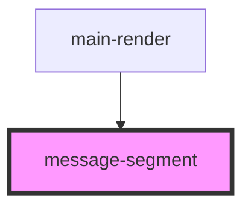

# message-segment

<!-- Auto Generated Below -->

## Properties

| Property       | Attribute       | Description | Type                                                            | Default     |
| -------------- | --------------- | ----------- | --------------------------------------------------------------- | ----------- |
| `firstObject`  | `first-object`  |             | `any`                                                           | `undefined` |
| `index`        | `index`         |             | `number`                                                        | `undefined` |
| `secondObject` | `second-object` |             | `any`                                                           | `undefined` |
| `segment`      | --              |             | `{ message: string; condition?: string; draggable?: boolean; }` | `undefined` |
| `values`       | --              |             | `{ [key: string]: string; }`                                    | `undefined` |

## Events

| Event              | Description | Type                                                   |
| ------------------ | ----------- | ------------------------------------------------------ |
| `inputChange`      |             | `CustomEvent<{ key: string; value: string; }>`         |
| `segmentDragStart` |             | `CustomEvent<number>`                                  |
| `segmentDrop`      |             | `CustomEvent<{ fromIndex: number; toIndex: number; }>` |

## Dependencies

### Used by

 - [main-render](../main-render)

### Graph

----------------------------------------------

*Built with [StencilJS](https://stenciljs.com/)*
